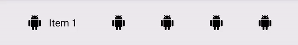

# AnimatedBar

Android library for an animated bar that animates visibility of items' title when an item is selected.



# Table of contents

* [Integration](#integration) 
* [Usage](#usage)
  - [Basics](#basics)
  - [Custom items](#custom-items)
  - [Setting from menu](#setting-from-menu)
  - [Styling](#styling)
  - [License](#license)

# Integration

Minimum SDK version (`minSdkVersion`): 15.

This library is released in Maven Central, so just add the following dependency in your `build.gradle` file:

```groovy
dependencies {
    // Other dependencies

    implementation 'fm.finch.android:animatedbar:1.0.2'
}
```

# Usage

## Basics

*The library is written entirely on Kotlin, so all the code below is in Kotlin, too.*

Using the library is pretty straightforward. 

Add AnimatedBar in your layout: 
```xml
<fm.finch.animatedbar.AnimatedBar
    android:id="@+id/animatedBar"
    android:layout_width="match_parent"
    android:layout_height="wrap_content" />
```

Set items via the `items` property. For example, here we generate and set a list of 5 items:
```kotlin
val animatedBarItems: List<AnimatedBarItem> = (1..5).map {
            AnimatedBarItem.Basic(
                id = it.toString(),
                title = "Item $it",
                icon = ContextCompat.getDrawable(this, R.drawable.ic_animated_bar_item))
            )
    }
animatedBar.items = animatedBarItems
```

*`AnimatedBarItem` is an interface, so to instantiate items, you need to use `AnimatedBarItem.Basic` class.*

Set selected item by passing its id to `selectedItemId`. For example, here we select the first item:
```kotlin
animatedBar.selectedItemId = animatedBarItems.first().id
```

By default, when user clicks on an item, it automatically gets selected. You can change that, or add some additional handling, by setting `onItemClicked`:
```kotlin
animatedBar.onItemClicked = { item -> 
     // You can add any custom handling here.
    // For example, lets make it so that clicking a selected item will deselect it.
    if (item.id == animatedBar.selectedItemId) {
        animatedBar.selectedItemId = null
    } else {
        animatedBar.selectedItemId = item.id
    }
    
    // Return true if you want the item to get automatically selected, false otherwise.
    // In this example we return false as we have already handled the event
    return false
}
```

*Note that `onItemClicked` is not invoked when settings the selected item via `selectedItemId`.*

You can use the `selectedItem` property, which returns currently selected item, or null, if no item is selected.

You can also disable animations with the `isAnimationEnabled` property. This can be useful, for example, when you load and set items asynchronously and want to set initial item without animations.
```kotlin
animatedBar.isAnimationEnabled = false

animatedBar.items = animatedBarItems
animatedBar.selectedItemId = animatedBarItems.first().id

animatedBar.isAnimationEnabled = true
```

## Custom items

You can easily set up an AnimatedBar that works with your custom items.

First, your item class needs to implement the `AnimatedBarItem` interface:
```kotlin
data class CustomAnimatedBarItem(
    override val id: String,
    override val title: String,
    override val icon: Drawable?,
    val someExtraData: String
) : AnimatedBarItem
```

Next, you need to create a sublass of `BaseAnimatedBar`, specifying `CustomAnimatedBarItem` for the generic type parameter:
```kotlin
class CustomAnimatedBar @JvmOverloads constructor(
    context: Context,
    attrs: AttributeSet? = null
) : BaseAnimatedBar<CustomAnimatedBarItem>(context, attrs)
```

Now you can add it to your layout:
```xml
<fm.finch.animatedbar.sample.custom.CustomAnimatedBar
        android:id="@+id/customAnimatedBar"
        android:layout_width="match_parent"
        android:layout_height="wrap_content" />
```
...and it will work with you custom item type:
```kotlin
val customBarItems = (1..5).map {
        CustomAnimatedBarItem(
            id = it.toString(),
            title = "Item ${it.toString().repeat(it)}",
            icon = drawable(R.drawable.ic_custom_bar_item),
            someExtraData = "Some extra data for item $it"
        )
    }
// customAnimatedBar expects CustomAnimatedBarItem objects for items
customAnimatedBar.items = customBarItems
customAnimatedBar.onItemClicked = { item->
    // Note that the item that is passed here is of CustomAnimatedBarItem type
    val someExtraData = item.someExtraData
    
    return true
}
```

## Setting from menu

If you use `AnimatedBar` or its subclass, you can also set items from a menu resource file. 

Place you menu file under the */menu* resource directory:
```xml
<menu xmlns:android="http://schemas.android.com/apk/res/android">

    <item
        android:id="@+id/menu_item_1"
        android:icon="@drawable/ic_action_bar_item"
        android:title="MenuItem1" />

    <item
        android:id="@+id/menu_item_2"
        android:icon="@drawable/ic_action_bar_item"
        android:title="MenuItem2" />

</menu>
```
...and set it to ActionBar with `setFromMenu` (in this example the file of the menu file is *animated_bar.xml*):
```kotlin
actionBar.setFromMenu(R.menu.animated_bar) { itemId, item ->
        // We can access title and icon of the item
        val title = item.title
        val icon = item.icon

        // itemId has been already cast to Int,
        // so we can check it the same way we usually do for menus.
        when (itemId) {
            R.id.menu_item_1 -> {
                // Do something
            }
            R.id.menu_item_2 -> {
                // Do something else
            }
        }

        // Return true to automatically select item
        true
    }
// To select an item, you need to cast its id to String
actionBar.selectedItemId = R.id.menu_item_1.toString()
```

## Styling

You can customize the look of the AnimatedBar by using the following attributes in layout (and corresponding properties in code):

| Attribute (in layout)     | Property (in code)        | Description   | Default value |
| ------------- | ------------- | -----------   | ------------- |
| `animatedBar_animationEnabled` | `isAnimationEnabled` | Whether animation is enabled or disabled. | true |
| `animatedBar_animationDuration` | `animationDuration` | Duration for item selection animation (in milliseconds). | 200 |
| `animatedBar_itemTitleAppearance` | `itemTitleAppearance` | Style for item's title. | Text size: 12sp |
| `animatedBar_itemIconSize` | `isAnimationEnabled` | Icon size for item.  | 18dp |
| `animatedBar_itemBackground` | `itemBackgroundRes` | Item background. | Transparent with ripple of `#10000000` |
| `animatedBar_itemTitleMargin` | `itemTitleMargin` | Margin between title and icon | 8dp |
| `animatedBar_itemPaddingVertical` | `itemPaddingVertical` | Top and bottom padding for item. | 8dp |
| `animatedBar_itemPaddingHorizontal` | `itemPaddingHorizontal` | Left and right padding for item. | 8dp |
| `android:background` | `background` | Background for AnimatedBar | Transparent |
| `android:layout_height` | - | Height for AnimatedBar | 52dp* |

*\*To use default height, set `android:layout_height=wrap_content`. To use custom height, set `android:layout_height` to any size you like.*

All the default values can be found in `@style/AnimatedBar`:
```xml
<style name="AnimatedBar">
    <item name="animatedBar_animationEnabled">true</item>
    <item name="animatedBar_animationDuration">@integer/animated_bar_animation_duration</item>
    <item name="animatedBar_itemTitleAppearance">@style/AnimatedBarTitleAppearance</item>
    <item name="animatedBar_itemIconSize">@dimen/animated_bar_item_icon_size</item>
    <item name="animatedBar_itemBackground">@drawable/animated_bar_item_bg</item>
    <item name="animatedBar_itemTitleMargin">@dimen/animated_bar_item_title_margin</item>
    <item name="animatedBar_itemPaddingVertical">@dimen/animated_bar_item_padding_vertical</item>
    <item name="animatedBar_itemPaddingHorizontal">@dimen/animated_bar_item_padding_horizontal</item>
</style>

<style name="AnimatedBarTitleAppearance">
    <item name="android:textSize">@dimen/text_animated_bar_item_title</item>
</style>
```

# License
```
Copyright 2019 Finch.

Licensed under the Apache License, Version 2.0 (the "License");
you may not use this file except in compliance with the License.
You may obtain a copy of the License at

   http://www.apache.org/licenses/LICENSE-2.0

Unless required by applicable law or agreed to in writing, software
distributed under the License is distributed on an "AS IS" BASIS,
WITHOUT WARRANTIES OR CONDITIONS OF ANY KIND, either express or implied.
See the License for the specific language governing permissions and
limitations under the License.
```